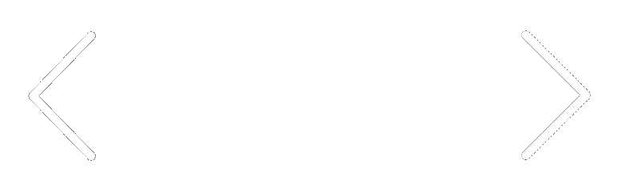
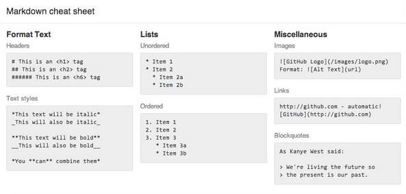

# VSCODE-REVEAL

 

<div style="margin-top:60px">
      
      <span style=" padding-top:18px;    text-align: left; display: block;">Vincent Bourdon</span>
      <i style="    text-align: left; display: block;
    color: rgba(0,0,0,.54);
    display: block;
    font-size:0.8em">
            <i class="fa fa-github" aria-hidden="true"></i>github.com/evilz
      </i>
      
  </div>

---

# Agenda

- Reveal Js
- Demo de vscode-reveal
- Création du plugin en typescript

---

# Reveal Js
créé par **Hakim El Hattab** le 7 Juin 2011

---

> A framework for easily creating beautiful presentations using HTML.

- Nested slides
- Markdown contents
- PDF export
- Speaker notes
- JavaScript API
- plugins
- slides.com

---

## Markdown



---

# Demo
### vscode-reveal

---

# Extention VS Code


---

## Prerequisites

Node Js + NPM

---

## Utilisation du template Yeoman

```
npm install -g yo generator-code
yo code
```

---

# Demo
### Template Yeoman

---

# Debug

- Appuyez sur `F5` ou cliquez sur l'icône Déboguer et cliquez sur Démarrer.
- VS code démarre en mode __Extension Development Host__ avec l'extention

---

<!-- .slide: data-background="debug.png" -->

---

# Test


* Ouvrez la vue de débogage et sélectionnez `Lancer Tests`
* Appuyez sur `F5` pour exécuter les tests
* Voir la sortie du résultat du test dans la console de débogage


---

<!-- .slide: data-background="test.png" -->

---

# Test

* Créer de nouveaux fichiers de test dans le dossier `test`
    * Par convention, le runner éxécute les tests des fichiers `**.Test.ts`
    * Vous pouvez créer des dossiers dans le dossier `test` pour structurer vos tests comme vous le souhaitez

---

# Test

- Les tests sont aussi écrits en typescript


---

<!-- .slide: data-background="test.png" -->

---

# Événements d'activation

Les extensions sont activées tardivement dans le VS code. 

Il faut s'abonner à des événements.

---

# Événements d'activation 

- `OnLanguage: ${language}`
- `OnCommand: ${command}`
- `OnDebug: ${type}`
- `WorkspaceContains: ${toplevelfilename}`
- `OnView: ${viewId}`

---

### vscode-reveal activationEvents

```json
"activationEvents": [
    "onLanguage:markdown",
    "onCommand:vscode-revealjs.showRevealJS",
    "onCommand:vscode-revealjs.showRevealJSInBrowser"
  ],
```

_package.json_ <!-- .element: style="float:right" -->


---

# Commands

Une commande est une contribution consistant en un titre et un id de commande enregistré

> Remarque: Lorsqu'une commande est appelée VS Code émettra un activationEvent `onCommand: ${command}`.

---

### vscode-reveal commands

```ts
// COMMAND : showRevealJS
    context.subscriptions.push(vscode.commands.registerCommand('vscode-revealjs.showRevealJS', () => {
        if (currentTab === null) { currentTab = vscode.window.activeTextEditor; }
        let uri = showRevealJS();
        if (uri) {
            return vscode.commands.executeCommand('vscode.previewHtml', uri, vscode.ViewColumn.Two, 'Reveal JS presentation')
                .then(
                (success) => { },
                (error) => { vscode.window.showErrorMessage(error); }
                );
        }
        else { return null; }
    }));

```
_extension.ts_ <!-- .element: style="float:right" -->

---

### vscode-reveal commands

```json
"contributes": {
    "commands": [
      {
        "command": "vscode-revealjs.showRevealJS",
        "title": "Revealjs: Show presentation by side"
      },
      {
        "command": "vscode-revealjs.showRevealJSInBrowser",
        "title": "Revealjs: Open presentation in browser"
      }
    ],

```
_package.json_ <!-- .element: style="float:right" -->

---

# Configuration

---

### Configuration

```json
"configuration": {
    "type": "object",
    "title": "Reveal JS Option Configuration",
    "properties": {
        "revealjs.notesSeparator": {
            "type": "string",
            "default": "note",
            "description": "Revealjs markdown note delimiter"
        },
       ...
    }
}
```

_package.json_ <!-- .element: style="float:right" -->

---

### Configuration

```
export class Configuration implements ExtensionOptions {

     public get revealJsOptions(){
         return <any>vscode.workspace.getConfiguration('revealjs') as RevealJsOptions;
     }

    public get slidifyOptions(){
         return <any>vscode.workspace.getConfiguration('revealjs') as SlidifyOptions;
     }
}
``` 

_Configuration.ts_ <!-- .element: style="float:right" -->


---

# Publish

---

### vsce - Publishing Tool Reference

- install VSCE
```sh
npm install -g vsce
```

- Créer un `Personal Access Token`
 https://www.visualstudio.com/products/visual-studio-team-services-vs

- publier !
```sh
vsce publish x.x.x
```


---

### Marketplace Integration

- `A README.md` : texte affiché sur la home de l'extension
- `package.json` :
    - lien du repository
    - license
    - couleur du background (galleryBanner.color)
    - icon
- `CHANGELOG.md` : Liste des modifications

---

# Show me the code !

- DocumentContext
- ContentProvider
- StatusBarController

---

# Conclusion

---

### les  +

- Template Yeoman
- typescript
- les Test et debug dans un VS Code
- La CLI
- Plein d'API

---

### Les - 

- Le manque de documentation
- Le manque d'exemple officiel
- Ca évolue trop vite ! :p

---

# Merci
## question ?

---

# Liens

- Documentation : https://code.visualstudio.com/docs/extensions/overview
- repository vscode-reveal : https://github.com/evilz/vscode-reveal
- Extension : https://marketplace.visualstudio.com/items?itemName=evilz.vscode-reveal